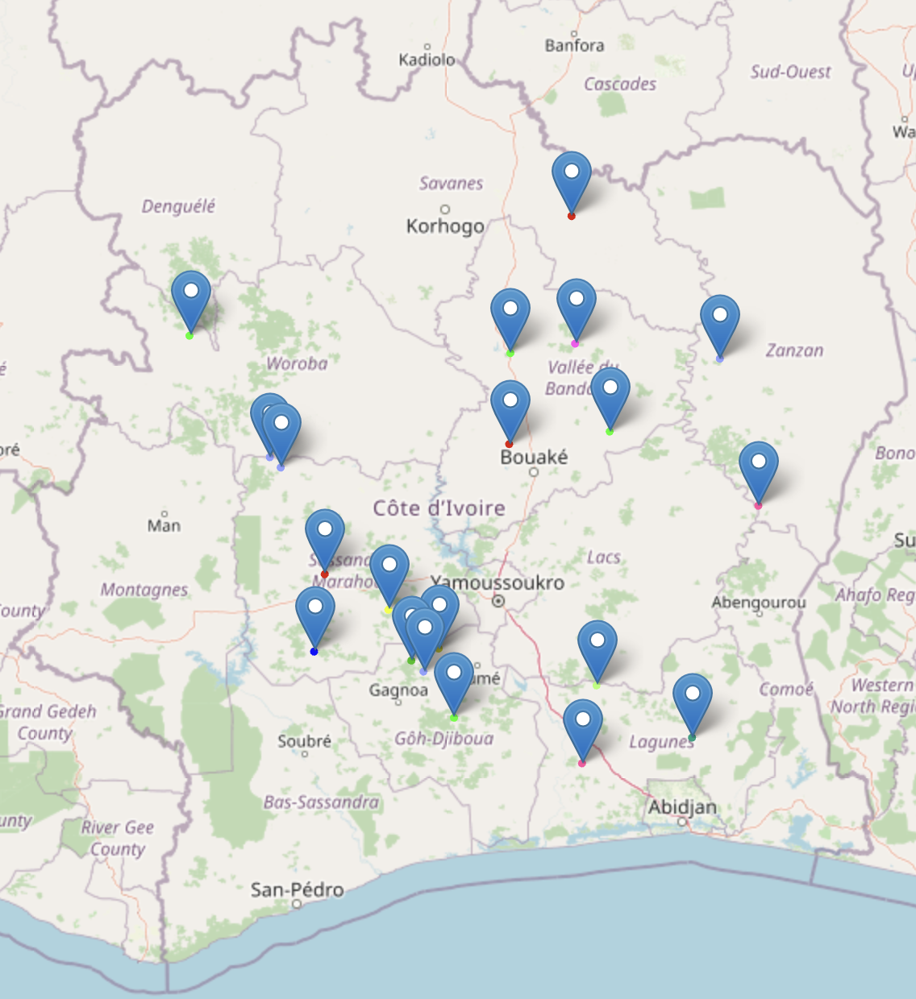

# DJANGO DISPLAY RESTAURANTS ON MAP WITH LEAFLET JS

## DEMO

### Credentials

    username: admin
    password: 1234
Go to <http://127.0.0.1:8000/admin/> and login with credentials provided.

### Create random restaurants in database

Run

```bash
python manage.py create_restaurants
```

Then run `python manage.py runserver` to start Django server. Finally <http://127.0.0.1:8000/> and you will see map markers indicating locations of restaurants.


